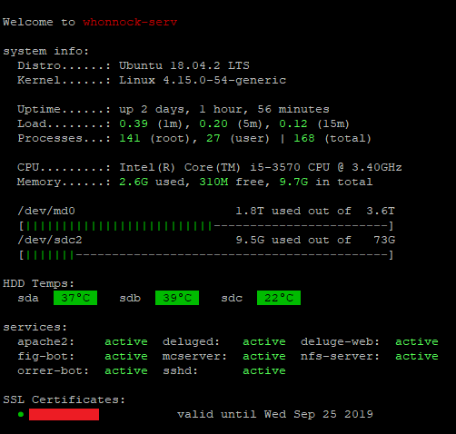

# MOTD-scripts

This repository contains MOTD scripts for my own server. Combined from [Falconstats (Heholord)](https://github.com/Heholord/FalconStats) and [MOTD (RIKRUS)](https://github.com/RIKRUS/MOTD).

# Requirements
 * `update-motd`
   - Needed for all scripts
 * `hddtemp`
   - Needed for showing temp in module 30-hdd-temp

# Screenshot


# Installing
1. In /etc/ssh/sshd_config set `PrintMotd yes`
2. Install `update-motd`
3. Install npm dependecies for SSL script `npm install` 
4. Edit each file and change/add the relevant info (Domains for SSL, HDDs, Services...)

Once thats done, copy the scripts and make theme executable 
```
git clone https://github.com/DJ-TrainR3k/MOTD-scripts.git
cd MOTD-scripts
sudo chown root:root *
sudo cp * /etc/update-motd.d/
sudo chmod +x /etc/update-motd.d/*
sudo update-motd
```
